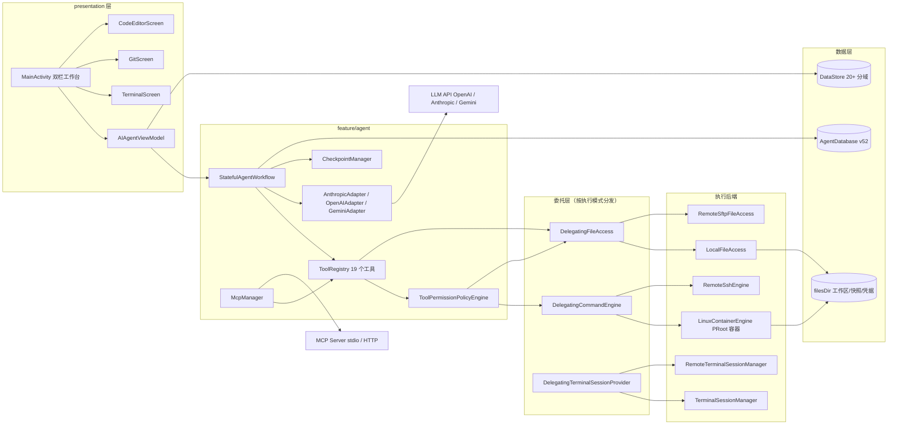
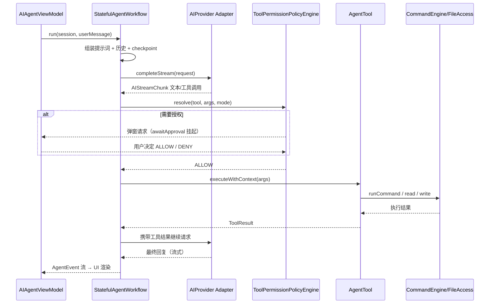
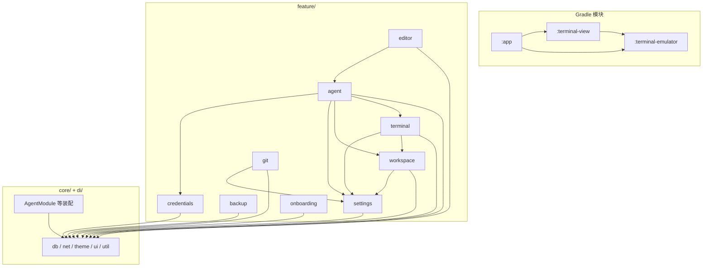

# 系统架构

## 概述

AiCode 是一款运行在 Android 手机上的 AI 编程工具，将大语言模型与本地 Linux 开发环境深度集成。它面向需要在移动设备上完成编码、调试与项目管理的开发者，使 AI 能直接读写文件、执行 Shell 命令、运行构建工具，并支持以远程 SSH 服务器作为执行后端，把手机变成远程项目的移动工作站。

系统的核心架构特征：

- **单 Activity + Compose 的 Kotlin 应用**：功能按 feature 分层（`agent` / `terminal` / `workspace` / `editor` / `git` / `settings` / `backup` / `credentials` / `onboarding`），每个 feature 内部再分 `data` / `domain` / `presentation` 三层，依赖注入统一由 Hilt 管理。
- **本地与远程双执行后端**：本地模式基于 Termux 组件与 PRoot 运行 Alpine Linux 容器；远程模式通过 sshj 以 SSH exec channel 执行命令、shell channel 驱动终端。两者共享同一套抽象接口（`CommandEngine` / `FileAccessProvider` / `TerminalSessionProvider`），由委托层按执行模式运行时分发。
- **AI Agent 引擎**：兼容 OpenAI / Anthropic / Gemini 三类协议，内置 19 个工具（文件读写、Shell 执行、搜索、待办、子代理派生等），支持 MCP 协议动态扩展工具、三种权限模式（BUILD / PLAN / AUTO）、检查点回滚与子代理并行。
- **数据库与资产随代码演进**：Room 数据库（版本 52）采用「文件式 SQL 迁移 + AutoMigration」双轨机制，45+ 个迁移脚本由 `MigrationLoader` 在启动时自动执行并对账。

## 技术栈

**语言与运行时**
- Kotlin（JVM target 17，KSP 编译期代码生成）
- Java（Termux 派生模块 `terminal-emulator` / `terminal-view`）
- Android：minSdk 26，targetSdk 28（锁定，见下文「关键架构决策」），compileSdk 36

**框架**
- UI：Jetpack Compose（Material 3，BOM 2026.01.00）、Navigation Compose
- 依赖注入：Hilt（Dagger 2.56.1）
- 持久化：Room 2.7.1（主数据库 `aicode_agent_db`）+ DataStore Preferences（20+ 个分域设置仓库）
- 网络：Retrofit 2.11 + OkHttp 4.12（LLM API）、sshj 0.38（SSH/SFTP）、commons-net + ftpserver-core（FTP 同步与内置 FTP 服务端）
- 编辑器：sora-editor 0.24.6（TextMate 语法高亮）
- 终端：Termux `terminal-emulator` / `terminal-view`（本地模块，经 JitPack 坐标对齐）
- 容器：PRoot（预编译 .so 走 jniLibs）+ Alpine rootfs（assets 内置 tar.gz）+ commons-compress（解压）

**数据存储**
- Room 数据库 `aicode_agent_db`：会话、消息、待办、检查点、LLM 调用记录、AI Provider、远程连接等
- DataStore：执行模式、主题、语言、代理、保活、编辑器设置等 20+ 分域偏好
- 文件系统：`filesDir/projects/`（工作区项目）、`filesDir/checkpoints/`（文件快照）、`filesDir/aicode/`（容器初始化资源与凭据文件）

**基础设施**
- CI/CD：GitHub Actions —— `ci.yml`（push/PR 冒烟构建 + 单测 + 迁移对账）、`android-release.yml`（v* Tag 触发三 flavor 签名 APK 发版）、`sync-gitcode.yml`（GitCode 镜像同步）
- 分发：GitHub Release（APK 直装，不上 Google Play）；F-Droid 可复现构建兼容

**外部服务**
- OpenAI / Anthropic / Gemini 三类 LLM API（含兼容网关，可自定义 baseUrl）
- MCP 服务器（本地 stdio 进程 / 远程 Streamable HTTP + SSE）
- models.dev（内置模型快照 `api.official.json` 的数据源，仅打 Tag 前手动刷新）

## 项目结构

```
project-root/
├── app/                            # 主应用模块（全部业务代码）
│   ├── src/main/java/com/aicode/
│   │   ├── AIEditorApp.kt          # @HiltAndroidApp Application，全局初始化
│   │   ├── MainActivity.kt         # 唯一 Activity，NavHost + 侧边栏 + 双栏布局
│   │   ├── WorkbenchPane.kt        # 大屏右栏容器（编辑器/终端/Git 三态切换）
│   │   ├── CrashActivity.kt        # 崩溃详情全屏页
│   │   ├── core/                   # 跨 feature 基础设施
│   │   │   ├── db/                 # MigrationLoader + SqlScriptSplitter（文件式迁移）
│   │   │   ├── net/                # AppProxy（全局代理 + provider 级代理分派）
│   │   │   ├── theme/              # Compose 主题与配色预设
│   │   │   ├── ui/                 # 通用 Compose 组件库
│   │   │   └── util/               # FileLogger、AILogger、LineDiff、GitIgnoreMatcher 等
│   │   ├── di/                     # Hilt 装配：AgentModule / RepositoryModule / BackupModule
│   │   └── feature/
│   │       ├── agent/              # AI Agent 核心（最大模块）
│   │       │   ├── data/           # Room 实体/DAO + 三协议 Retrofit API
│   │       │   ├── domain/         # 工具系统、provider 适配、MCP、workflow、checkpoint、子代理
│   │       │   └── presentation/   # AIAgentViewModel + AIChatPanel 及全部聊天组件
│   │       ├── terminal/           # 终端会话（本地 PRoot / 远程 SSH）+ 保活服务
│   │       ├── workspace/          # 工作区抽象、文件访问、SAF Provider、同步引擎
│   │       ├── editor/             # sora-editor 封装、TextMate、编码检测
│   │       ├── git/                # 容器内命令行 git 的可视化封装
│   │       ├── settings/           # Provider 管理、20+ DataStore 仓库、执行模式
│   │       ├── backup/             # tar.gz + AES-GCM 加密备份恢复
│   │       ├── credentials/        # Git 凭据文件仓库与 helper IPC 桥
│   │       └── onboarding/         # 首启 spotlight 引导
│   ├── src/main/assets/
│   │   ├── prompts/                # AI 系统提示词分片（12 个编号 .md + agent/）
│   │   ├── migrations/             # 45+ 个 {VERSION}_{description}.sql 迁移脚本
│   │   ├── aicode/                 # 容器初始化：provision.sh、git-credential-aicode
│   │   ├── container/              # Alpine rootfs（按 flavor 提供 arm/x86）
│   │   └── api.official.json       # 内置 provider/模型快照
│   └── schemas/                    # Room 导出的 schema JSON（编译期校验）
├── terminal-emulator/              # Termux 终端仿真核心（Java，Apache 2.0）
├── terminal-view/                  # Termux 终端渲染 View（Java）
├── docs-site/                      # VitePress 用户文档（构建期经 syncAiDocs 打进 APK）
├── scripts/                        # check_migrations.py 等维护脚本
└── .github/workflows/              # CI 与发版流水线
```

**入口点**
- `AIEditorApp.kt` — Application：attachBaseContext 装 FileLogger/崩溃处理器/全局代理；onCreate 初始化 MCP、凭据桥、保活、WorkManager
- `MainActivity.kt` — 唯一 Activity：Compose 导航、抽屉侧边栏、宽屏双栏工作台
- `WorkbenchPane.kt` — 大屏右栏：编辑器 / 终端 / Git 面板容器

## 子系统

### 1. AI Agent 引擎（feature/agent）

**目的**：驱动 LLM 对话循环——组装提示词 → 调用 provider → 解析工具调用 → 权限判定 → 执行工具 → 回填结果，直至产出最终回复。
**位置**：`app/src/main/java/com/aicode/feature/agent/`
**关键文件**：`domain/workflow/StatefulAgentWorkflow.kt`（状态机主循环）、`domain/tool/AgentTool.kt` + `ToolRegistry.kt`（工具系统）、`domain/provider/AnthropicAdapter.kt` 等（协议适配）、`domain/permission/ToolPermissionPolicyEngine.kt`（授权策略）、`domain/mcp/McpManager.kt`（MCP 扩展）、`domain/checkpoint/CheckpointManager.kt`（检查点）、`domain/tool/subagent/TaskTool.kt`（子代理派生）、`presentation/AIAgentViewModel.kt`（UI 状态中枢，约 1900 行）
**依赖**：terminal（CommandEngine 执行命令）、workspace（FileAccessProvider 读写文件）、settings（AIProviderRepository 拿模型配置）、credentials
**被依赖**：MainActivity 的聊天面板、terminal 的 AI 终端工具

### 2. 终端与执行引擎（feature/terminal）

**目的**：提供多标签终端会话与后台命令执行；统一「本地 PRoot 容器」与「远程 SSH」两种后端。
**位置**：`app/src/main/java/com/aicode/feature/terminal/`
**关键文件**：`domain/TerminalSessionProvider.kt`（后端接口）、`domain/TerminalSessionManager.kt`（本地会话池）、`domain/RemoteTerminalSessionManager.kt` + `domain/SshShellBackend.kt`（远程 shell channel）、`domain/DelegatingTerminalSessionProvider.kt`（模式分发）、`domain/TerminalKeepaliveService.kt`（前台服务保活）+ `domain/KeepaliveWorker.kt`（WorkManager 兜底）
**依赖**：`terminal-emulator` / `terminal-view` 模块（Termux 派生）、agent 的 `RemoteSshConnection`
**被依赖**：AI 工具（`TerminalSessionTool`）、终端 UI（TerminalScreen）

### 3. 工作区与文件访问（feature/workspace）

**目的**：管理项目工作区（本地私有目录 / 远程 SSH 目录），提供统一的文件读写后端，并承担 SAF 导出、SFTP/FTP 同步。
**位置**：`app/src/main/java/com/aicode/feature/workspace/`
**关键文件**：`domain/FileAccessProvider.kt`（接口）、`domain/LocalFileAccess.kt` / `domain/RemoteSftpFileAccess.kt`（实现；远程走 SSH exec channel 读写，规避 sshj SFTP 缓冲区溢出 bug）、`domain/DelegatingFileAccess.kt`（分发）、`domain/WorkspacePathMapper.kt`（容器路径 ⇄ 宿主路径映射）、`data/repository/WorkspaceRepository.kt`（工作区管理）、`data/provider/WorkspaceDocumentsProvider.kt`（SAF）、`domain/remote/SyncEngine.kt`（文件同步）
**依赖**：agent 的 `RemoteSshConnection`、settings 的 `ExecutionModeHolder`
**被依赖**：AI 文件工具、编辑器、Git 面板

### 4. 设置与 Provider 管理（feature/settings）

**目的**：管理 AI Provider（多 Key 轮换、每提供商代理）、执行模式切换、主题语言等 20+ 分域设置。
**位置**：`app/src/main/java/com/aicode/feature/settings/`
**关键文件**：`data/local/entity/AIProviderEntity.kt`（Room）、`data/repository/ExecutionModeRepository.kt`（本地/远程模式）、`ExecutionModeHolder.kt`（模式内存缓存，三个委托层的分发依据）、`ProviderKeyRotator.kt`（Key 轮换）、`data/remote/UpdateCheckService.kt`（更新检查）
**依赖**：Room（AgentDatabase 挂载其实体）
**被依赖**：几乎所有 feature（拿配置与模式）

### 5. 备份与凭据（feature/backup + feature/credentials）

**目的**：加密备份恢复全量数据；Git 凭据的文件化存储与容器内注入。
**位置**：`app/src/main/java/com/aicode/feature/backup/`、`app/src/main/java/com/aicode/feature/credentials/`
**关键文件**：`backup/domain/BackupManager.kt` + `backup/data/BackupManagerImpl.kt`（流式 tar.gz + PBKDF2/AES-GCM）、`credentials/data/repository/FileCredentialRepository.kt`（git-credential-store 格式文件）、`credentials/data/CredentialRequestBridge.kt`（credential helper 文件 IPC 桥）
**依赖**：AgentDatabase 各 DAO、commons-compress
**被依赖**：设置页、Git 操作

### 6. 跨模块基础设施（core/ + di/）

**目的**：数据库迁移加载、全局代理、主题、通用 UI 组件、日志；以及 app 层 Hilt 总装配。
**位置**：`app/src/main/java/com/aicode/core/`、`app/src/main/java/com/aicode/di/`
**关键文件**：`core/db/MigrationLoader.kt`、`core/db/SqlScriptSplitter.kt`、`core/net/AppProxy.kt`、`core/util/FileLogger.kt`、`di/AgentModule.kt`（核心装配：数据库、Retrofit、ToolRegistry、委托绑定）
**依赖**：无业务依赖（底层）
**被依赖**：全部 feature

## 关键架构决策

### 本地/远程委托模式

本地（PRoot 容器）与远程（SSH）是两条完全不同的执行链路，但通过三个接口统一：

| 抽象接口 | 本地实现 | 远程实现 |
|---------|---------|---------|
| `CommandEngine`（命令执行） | `LinuxContainerEngine`（PRoot 拉起容器内命令） | `RemoteSshEngine`（sshj exec channel） |
| `FileAccessProvider`（文件读写） | `LocalFileAccess`（java.io.File） | `RemoteSftpFileAccess`（SSH exec + 重定向/base64） |
| `TerminalSessionProvider`（终端会话） | `TerminalSessionManager`（本地 PTY） | `RemoteTerminalSessionManager`（sshj shell channel） |

每个接口对应一个 `Delegating*` 委托类，方法调用时读 `ExecutionModeHolder.currentMode()` 决定转发目标。切换执行模式即时生效，上层（AI 工具、编辑器、Git）无感知。

### targetSdk 锁定 28

PRoot 需要在 App 可写目录执行二进制，Android 10+ 的 W^X / SELinux 禁止该行为。解法：proot 全套以 `lib*.so` 命名走 jniLibs，安装后解压到 `nativeLibraryDir`（App 目录中唯一允许 execve 的位置）；客户机二进制由 proot loader 用 `mmap(PROT_EXEC)` 映射进内存，绕开内核 execve。代价是无法上架 Google Play。

### 数据库迁移双轨制

- **文件式（默认）**：`core/db/MigrationLoader.kt` 扫描 `assets/migrations/{VERSION}_{description}.sql`，由 `SqlScriptSplitter` 按语句切分（识别注释与字符串字面量），整段包事务、失败整体回滚，成功记入 `migration_history` 表。适用于含数据清理/重命名的复杂变更。
- **AutoMigration**：纯 schema 变更（加列/建表/索引）用 `@AutoMigration` 编译期生成。
- 两者编号共用一个连续序列（当前 SCHEMA_VERSION = 52），由 `scripts/check_migrations.py` 对账（编号连续、已发布 Tag 的迁移冻结不可篡改）。

### flavor 按容器镜像拆包

`universal`（arm64 + x86 两套 rootfs）/ `armsolo`（仅 arm）/ `x86solo`（仅 x86）三个 flavor 共享 sourceSet：`_armAssets`/`_x86Assets` 与 `_armJniLibs`/`_x86JniLibs` 各只放一份二进制，由 AGP 资源并集合并，单架构包体积约为通用包的一半。

## 图表

### 系统架构总览



### AI 请求-工具循环时序



### 模块依赖关系


