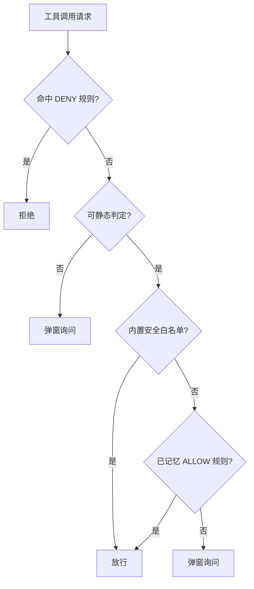
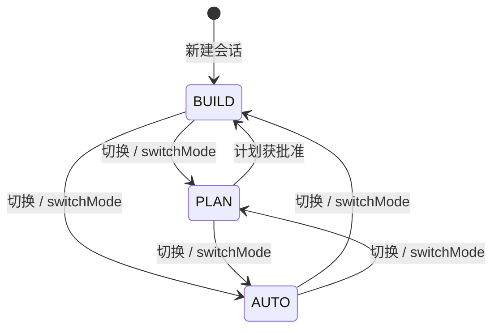

# Agent 权限模式（BUILD / PLAN / AUTO）

权限模式控制 AI 工具的授权范围，按信任程度在「逐步授权」与「完全放行」之间切换。它与[执行模式](./执行模式.md)正交：权限模式决定 AI 能做什么，执行模式决定在哪做。

## 什么是权限模式？

每个会话有独立的 `AgentMode`（领域模型 `feature/agent/domain/model/`），UI 上随时可切。AI 也可通过 `switchMode` 工具自行切换（受授权策略约束）。

**三种模式**:

| 模式 | 行为 |
|------|------|
| `BUILD` | 正常开发模式：写操作按授权规则弹窗确认 |
| `PLAN` | 只读规划：`ToolPermissionPolicyEngine` 在工具层物理拦截全部写操作，AI 只能调研并输出计划；计划经 `PlanApprovalManager` 批准后切回执行 |
| `AUTO` | 全部放行免授权，保留灾难性命令防护（如递归删除根目录类 `rm`） |

## 代码位置

| 方面 | 位置 |
|------|------|
| 模式定义 | `feature/agent/domain/model/`（`ChatSession` 携带 `AgentMode`） |
| 策略引擎 | `feature/agent/domain/permission/ToolPermissionPolicyEngine.kt` |
| 授权中台 | `feature/agent/domain/tool/ToolPermissionManager.kt` |
| 模式切换工具 | `feature/agent/domain/tool/mode/SwitchModeTool.kt` |
| 计划批准流 | `PlanApprovalManager` |
| 提示词 | `app/src/main/assets/prompts/80-plan-mode.md`、`81-auto-mode.md` |

## 授权判定顺序

`ToolPermissionPolicyEngine.resolve()` 对每次工具调用（弹窗前）按序判定：

**关键细节**:
- 「始终允许」按命令前缀记忆：`git` / `npm` 记到子命令级，避免过宽放行
- PLAN 模式的拦截发生在策略引擎层（物理拦截），`ToolRegistry` 仍返回全部工具定义
- `ToolPermissionManager.awaitApproval()` 用 CompletableDeferred 挂起等待用户弹窗选择，多会话并行互不阻塞
- Shell 命令解析由 `ShellCommandParser` 支持，识别管道与组合命令的各段

## 生命周期

## 关系

| 关联概念 | 关系 | 描述 |
|---------|------|------|
| [执行模式](./执行模式.md) | 正交 | 权限模式约束「做什么」，执行模式决定「在哪做」 |
| 检查点 | 兜底 | AUTO 模式下文件改动仍有检查点快照，可回滚 |
