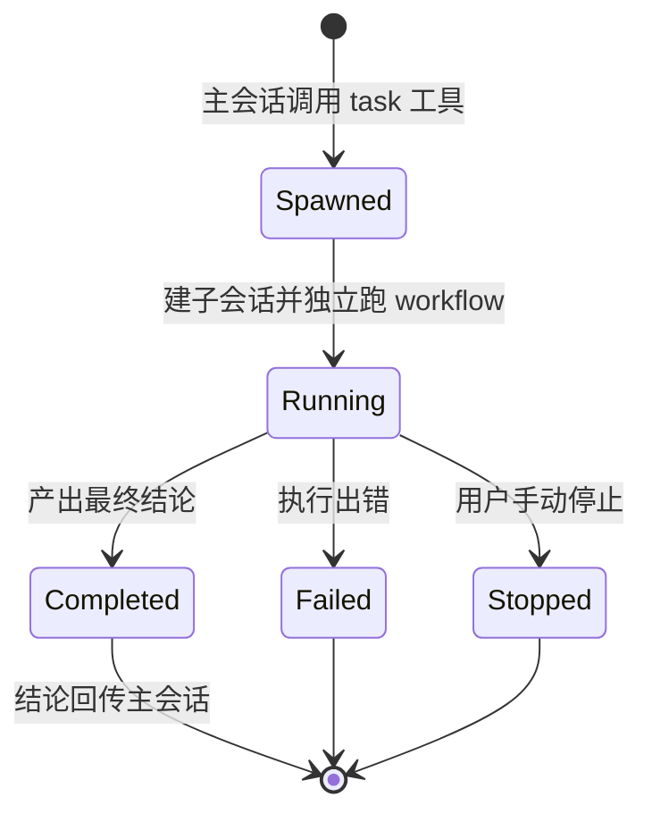

# 子代理（Subagent）

主会话派生出的拥有独立上下文的后台代理：并行调研、审查或对比方案，全程不阻塞当前对话。

## 什么是子代理？

子代理是一个独立跑完整 Agent 工作流的子会话——有自己的消息历史、上下文窗口与工具集，由主会话通过 `task` 工具派生。主对话收到的是子代理的最终结论，中间过程在侧边栏按父子关系展开查看。

**关键特征**:
- **独立上下文**：`ChatSession.parentId` 建立父子关系，子代理消息与主会话隔离，避免污染主上下文
- **定义可定制**：`AgentDefinition` 描述名称、提示词注入片段（`InjectPart`）、允许的工具集；支持全局与项目两级（项目级放 `.agents/` 目录）
- **内置 Explore**：只读调研型子代理（对应 assets/agents/explore.md）
- **事件总线**：`SubAgentEventBus` 广播 SPAWNED / COMPLETED / FAILED / STOPPED，UI 据此展示进度

## 代码位置

| 方面 | 位置 |
|------|------|
| 派生入口 | `feature/agent/domain/tool/subagent/TaskTool.kt`（`task` 工具） |
| 定义模型 | `feature/agent/domain/subagent/AgentDefinition.kt` |
| 定义解析 | `AgentDefinitionParser` / `LocalDirectoryAgentSource` / `ProjectDirectoryAgentSource` |
| 定义仓库 | `AgentDefinitionRepository` / `AgentDefinitionConfigRepository` |
| 事件总线 | `SubAgentEventBus` |
| 会话模型 | `ChatSession.parentId` / `subagentType`（`feature/agent/domain/model/`） |
| 内置定义 | `app/src/main/assets/agents/explore.md` |
| UI | `feature/settings/presentation/component/SubAgentsSection.kt`（管理）、聊天侧边栏（进度展开） |

## 结构

```
AgentDefinition
├── name             // 子代理名（task 工具的 subagentType 参数）
├── prompt           // InjectPart 列表：注入到子代理系统提示词的片段
├── tools            // 允许的工具集（缺省继承全部）
└── scope            // global / project（.agents/ 目录，随工作区走）
```

## 生命周期



事件经 `SubAgentEventBus` 广播，主 UI 侧边栏实时展示各子代理状态。

## 不变量

1. **父子关系单向**：子代理可再派生子代理，`parentId` 链只在创建时确定
2. **工具集受权限体系约束**：子代理的授权仍走 [Agent 权限模式](./Agent权限模式.md) 的策略引擎，定义中的 `tools` 只是可见范围收窄
3. **结论才回传**：子代理的全部中间消息留在子会话，主会话只收最终回复

## 关系

| 关联概念 | 关系 | 描述 |
|---------|------|------|
| 检查点 | 独立快照链 | 每个子会话有自己的检查点 |
| [Agent 权限模式](./Agent权限模式.md) | 共享授权体系 | 子代理工具调用同样过策略引擎 |
