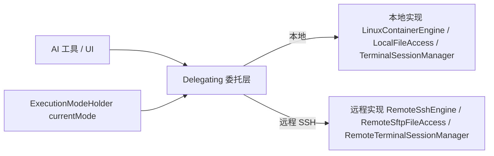

# 执行模式（Execution Mode）

执行模式决定「命令、文件、终端在哪跑」——是本机 PRoot Linux 容器，还是远程 SSH 服务器。它是 AiCode 双后端架构的中枢概念，三个委托层（命令/文件/终端）每次调用都依据它分发。

## 什么是执行模式？

执行模式是全局唯一的运行时状态，持久化在 DataStore（`execution_mode_prefs`），并在内存中由 `ExecutionModeHolder`（`feature/settings/`）以 StateFlow 缓存——委托层同步读取，切换即时生效。

**关键特征**:
- 两种取值：本地 PRoot 容器 / 远程 SSH
- 对 AI 工具与 UI 完全透明：`Bash` 工具、编辑器、Git 面板只依赖抽象接口
- 远程模式下 MCP stdio 服务器跑在远程默认容器上，文件同步与凭据注入随之切换

## 代码位置

| 方面 | 位置 |
|------|------|
| 模式缓存 | `feature/settings/ExecutionModeHolder.kt` |
| 持久化 | `feature/settings/data/repository/ExecutionModeRepository.kt` |
| 命令分发 | `feature/agent/domain/container/DelegatingCommandEngine.kt` |
| 文件分发 | `feature/workspace/domain/DelegatingFileAccess.kt` |
| 终端分发 | `feature/terminal/domain/DelegatingTerminalSessionProvider.kt` |
| 远程连接 | `feature/agent/data/remote/RemoteSshConnection.kt`（共享 sshj client） |

## 委托分发机制

委托类是纯分发器：每个方法先读 `currentMode()`，再转发对应实现。新增执行后端时只需新增实现类并扩展委托层分支。

## 关系

| 关联概念 | 关系 | 描述 |
|---------|------|------|
| [PRoot 容器](./PRoot容器.md) | 本地模式的底层 | 本地模式实际在 PRoot 容器内执行 |
| [Agent 权限模式](./Agent权限模式.md) | 正交概念 | 执行模式决定「在哪跑」，权限模式决定「AI 能做什么」 |
