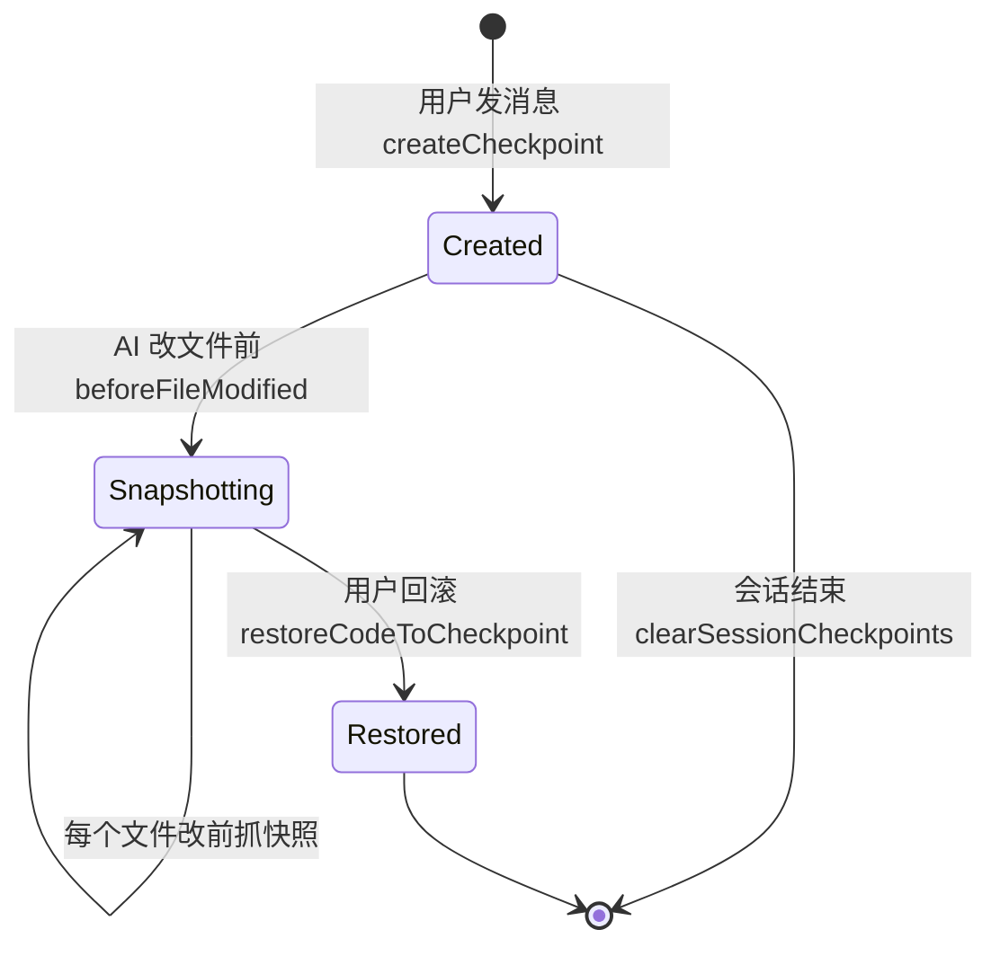

# 检查点（Checkpoint）

Agent 修改代码前的自动快照机制：每条用户消息建一个检查点节点，每次文件被改前抓单文件快照，对话中可一键回滚代码、对话或两者。

## 什么是检查点？

检查点是「可回滚的最小安全网」：它解决 AI 改错代码后无法恢复的问题。实现分两层——Room 记录元数据（哪些文件、何时、归属哪个会话），文件内容副本存私有目录（`filesDir/checkpoints/<sessionId>/<checkpointId>/`）。

**关键特征**:
- **自动创建**：用户每发一条消息，`createCheckpoint()` 建节点；无需用户操作
- **改前快照**：`beforeFileModified()` 在每次文件修改前执行，只备份将被覆盖的文件（增量，省空间）
- **三维回滚**：仅恢复代码 / 仅恢复对话 / 两者同时恢复（`RewindOptionsBottomSheet` 让用户选）
- **按会话隔离**：活动 checkpoint 按会话管理，多会话并行互不干扰

## 代码位置

| 方面 | 位置 |
|------|------|
| 管理器 | `feature/agent/domain/checkpoint/CheckpointManager.kt` |
| 元数据实体 | `feature/agent/data/local/entity/CheckpointEntity.kt`（session_checkpoints 表） |
| 快照实体 | `feature/agent/data/local/entity/CheckpointFileSnapshotEntity.kt`（checkpoint_file_snapshots 表） |
| DAO | `feature/agent/data/local/dao/CheckpointDao.kt` |
| 回滚 UI | `feature/agent/presentation/component/RewindOptionsBottomSheet.kt` |
| 文件存储 | `filesDir/checkpoints/<sessionId>/<checkpointId>/` |

## 结构

```
CheckpointEntity（节点）
├── sessionId        // 归属会话
├── userMessageId    // 关联的用户消息
└── createdAt
CheckpointFileSnapshotEntity（快照，多条/节点）
├── checkpointId     // 归属检查点
├── filePath         // 被改文件的容器路径
└── backupPath       // filesDir 下的副本位置
```

## 生命周期



## 不变量

1. **先快照后修改**：所有走 `writeFile` / `editFile` 工具的写入必须先过 `beforeFileModified()`，直接写盘的代码路径会绕过保护
2. **快照与元数据一致**：`CheckpointFileSnapshotEntity` 记录的 backupPath 必须真实存在，回滚依赖它
3. **清理不可逆**：`clearSessionCheckpoints()` 会删文件副本，回滚窗口仅限会话存活期

## 关系

| 关联概念 | 关系 | 描述 |
|---------|------|------|
| [Agent 权限模式](./Agent权限模式.md) | 兜底安全网 | AUTO 模式免授权，检查点是误操作的最后防线 |
| 子代理 | 共享 | 子代理会话同样有独立的检查点链 |
