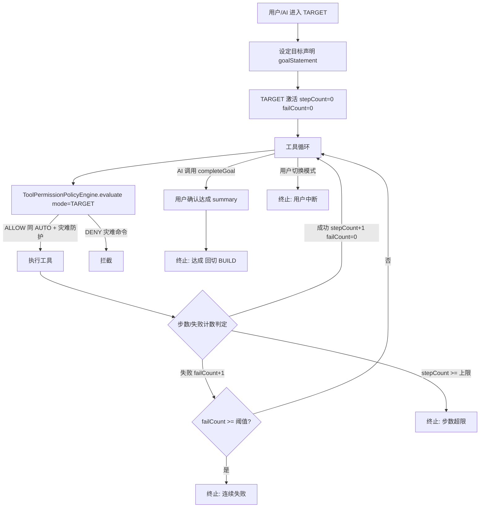

# TARGET 目标驱动权限模式

Feature Name: permission-mode-target
Updated: 2026-09-12

## Description

在现有三档权限模式（BUILD / PLAN / AUTO）之外新增第四档 **TARGET（目标驱动）**。用户进入时设定目标声明，AI 自主规划并执行工具调用直到目标达成或失败，期间免逐步弹窗授权（授权策略等同 AUTO，保留灾难命令防护与检查点回滚），由步数上限与连续失败阈值约束终止。TARGET 与现有三档完全互切。

**与现有模式差异**：

| 模式 | 授权 | 终止 | 工具可进入 | 达成声明 |
|------|------|------|-----------|---------|
| BUILD | 逐步弹窗 | 无 | 是 | — |
| PLAN | 物理拦截写 | 计划批准 | 是 | — |
| AUTO | 全放行 + 灾难防护 | 仅用户手动 | 否（仅手动） | — |
| TARGET | 全放行 + 灾难防护 | 达成 / 失败 / 步数 / 用户中断 | 是（需 goal 参数） | `completeGoal` 工具 |

## Architecture

### 关键设计决策

1. **达成声明用独立 `completeGoal` 工具**：相比复用 `switchMode(mode=BUILD)`，专用工具语义明确（"声明达成"与"切换模式"职责分离）、授权策略独立（`ASK` 弹窗展示 summary 供确认）、可强制 `summary` 参数。代价是内置工具数 19 → 20，需同步 `di/AgentModule.kt`、`INTERFACES.md`、`prompts/`。
2. **阈值接入 DataStore**：初版即用 `TargetModeSettingsRepository`（分域 `target_mode_prefs`，默认 50/5）而非硬编码常量，用户可在设置页调整以适配不同复杂度任务。workflow 注入仓库取当前值。
3. **终止判定在 workflow 层**：`ToolPermissionPolicyEngine` 只做单次工具调用的 ALLOW/DENY/ASK 判定（TARGET 复用 AUTO 逻辑），步数与失败计数由 `StatefulAgentWorkflow` 在工具循环层维护，职责不越界。
4. **灾难拦截不计入 failCount**：`failCount` 只统计工具实际执行后返回 `ToolResult.Error` 的次数；策略引擎的 DENY（如灾难命令）是预防性阻断，非执行失败。

### 模式判定与执行流



### 授权策略复用

TARGET 在 `ToolPermissionPolicyEngine.evaluate()` 中的授权判定**复用 AUTO 分支逻辑**（放行全部 + `checkCatastrophicRm` 灾难防护）。终止条件（步数、连续失败）不放在策略引擎——策略引擎只负责单次工具调用的 ALLOW/DENY/ASK 判定，步数与失败计数由 `StatefulAgentWorkflow` 在工具循环层维护。

## Components and Interfaces

### 1. AgentMode 枚举扩展

`app/src/main/java/com/aicode/feature/agent/domain/model/ChatSession.kt:6`

```kotlin
enum class AgentMode {
    BUILD,
    PLAN,
    AUTO,
    TARGET  // 目标驱动：AI 依据 goalStatement 自主执行，达成或失败即终止
}
```

新增 `TARGET` 枚举值。`ChatSessionEntity.toDomain()` 已用 `runCatching { AgentMode.valueOf(mode) }` 解析，旧数据不受影响。

### 2. ChatSession 领域模型扩展

`ChatSession.kt:15` 新增字段：

```kotlin
data class ChatSession(
    // ... 现有字段
    val goalStatement: String? = null,         // TARGET 模式的目标声明
    val goalTerminationReason: String? = null, // 终止原因：ACHIEVED/FAILED/STEP_LIMIT/INTERRUPTED
    val goalStepCount: Int = 0,                // 当前 TARGET 执行的工具调用步数
    val goalFailCount: Int = 0                 // 连续失败计数
)
```

### 3. ToolPermissionPolicyEngine 扩展

`ToolPermissionPolicyEngine.kt:64` 的 `evaluate()`：

在现有 AUTO 分支（第 70 行）之前或并列加入 TARGET 分支。TARGET 的授权逻辑与 AUTO 完全一致（放行 + 灾难防护），可抽取共用方法：

```kotlin
if (mode == AgentMode.AUTO || mode == AgentMode.TARGET) {
    if (isShellTool(toolName, args)) {
        val command = ((args["command"] ?: args["input"]) as? JsonPrimitive)?.content
        if (command != null) {
            val analysis = ShellCommandParser.analyze(command)
            val catastrophicReason = checkCatastrophicRm(analysis.segments)
            if (catastrophicReason != null) {
                return EvalResult(Verdict.DENY, emptyList(), denyReason = catastrophicReason)
            }
        }
    }
    return EvalResult(Verdict.ALLOW, emptyList())
}
```

> 注意：PLAN 分支（第 66 行）对 TARGET 不生效——TARGET 允许写操作。判定顺序保持 PLAN 拦截在前、AUTO/TARGET 放行在后。

### 4. StatefulAgentWorkflow 终止条件维护

`feature/agent/domain/workflow/StatefulAgentWorkflow.kt` 的工具循环层新增 TARGET 步数与失败计数：

- 每次工具执行后 `goalStepCount + 1`，成功则 `goalFailCount = 0`，失败则 `goalFailCount + 1`。
- `goalStepCount >= MAX_STEP_BUDGET` → 终止，`goalTerminationReason = STEP_LIMIT`。
- `goalFailCount >= MAX_CONSECUTIVE_FAILURES` → 终止，`goalTerminationReason = FAILED`。
- AI 声明达成（通过约定消息标记或 `switchMode` 回切 BUILD）→ 提示用户确认 → `goalTerminationReason = ACHIEVED`，切回 BUILD。
- 用户手动切换模式 → `goalTerminationReason = INTERRUPTED`。

阈值经 DataStore 持久化与读取（见组件 11 `TargetModeSettingsRepository`），workflow 注入该仓库取当前值：

```kotlin
data class TargetModeThresholds(
    val maxStepBudget: Int = 50,
    val maxConsecutiveFailures: Int = 5
)
```

workflow 工具循环每次读取 `TargetModeSettingsRepository.thresholds.first()` 后比对 `goalStepCount` / `goalFailCount`。

### 5. SwitchModeTool 扩展

`SwitchModeTool.kt:31` 参数扩展：

```kotlin
override val parameters: Map<String, ToolParameter> = mapOf(
    "mode" to ToolParameter(
        name = "mode",
        type = ParameterType.STRING,
        description = "目标模式，必须是 'PLAN'、'BUILD' 或 'TARGET'",
        required = true,
        enum = listOf("PLAN", "BUILD", "TARGET")
    ),
    "reason" to ToolParameter(/* 不变 */),
    "goal" to ToolParameter(
        name = "goal",
        type = ParameterType.STRING,
        description = "切换到 TARGET 模式时的目标声明，描述 AI 需自主达成的目标。仅 mode=TARGET 时必需",
        required = false
    )
)
```

`executeWithContext()` 逻辑调整（`SwitchModeTool.kt:47`）：

- `mode=target` 且缺少 `goal` → 返回 `ToolResult.Error(..., "MISSING_GOAL")`。
- `mode=target` 且有 `goal` → `chatSessionDao.upsert(sessionEntity.copy(mode = TARGET, goalStatement = goal, goalStepCount = 0, goalFailCount = 0))`。
- AUTO 仍保持仅手动进入（第 63 行逻辑不变）。
- 从 TARGET 通过工具切出（到 PLAN/BUILD）→ 记录 `goalTerminationReason = INTERRUPTED`。

> 目标**达成声明**不走 SwitchModeTool，改用专用 `completeGoal` 工具（见组件 10），语义更明确、授权策略独立。

### 6. completeGoal 工具（新增第 20 个内置工具）

新增 `app/src/main/java/com/aicode/feature/agent/domain/tool/mode/CompleteGoalTool.kt`：

```kotlin
class CompleteGoalTool @Inject constructor(
    private val chatSessionDao: ChatSessionDao
) : AbstractContextualTool() {

    override val name = "completeGoal"
    override val description = "声明当前 TARGET 模式的目标已达成。调用后 AiCode 会提示用户确认，确认即退出 TARGET 回到 BUILD。仅在 TARGET 模式可用。"
    override val permissionPolicy = ToolPermissionPolicy.ASK
    override val capabilities = setOf(ToolCapability.MODIFY_SESSION_STATE)

    override val parameters: Map<String, ToolParameter> = mapOf(
        "summary" to ToolParameter(
            name = "summary",
            type = ParameterType.STRING,
            description = "目标达成总结，说明完成的工作与最终状态，展示给用户确认",
            required = true
        )
    )
}
```

`executeWithContext()`：
- 非 TARGET 模式调用 → `ToolResult.Error(..., "NOT_IN_TARGET_MODE")`。
- TARGET 模式且带 `summary` → 标记 `goalTerminationReason = ACHIEVED`，切回 BUILD，返回成功提示用户确认。
- `buildPermissionRequest()` 展示 summary 供用户确认是否达成。

注册于 `di/AgentModule.kt`（内置工具清单从 19 → 20），同步 `INTERFACES.md` 内置工具表。

### 7. TargetModeSettingsRepository（DataStore）

`feature/settings/data/repository/` 新增 `TargetModeSettingsRepository`，DataStore 分域 `target_mode_prefs`：

```kotlin
data class TargetModeThresholds(
    val maxStepBudget: Int = 50,
    val maxConsecutiveFailures: Int = 5
)

class TargetModeSettingsRepository @Inject constructor(
    private val dataStore: DataStore<Preferences>
) {
    val thresholds: Flow<TargetModeThresholds> = dataStore.data.map { prefs ->
        TargetModeThresholds(
            maxStepBudget = prefs[MAX_STEP_BUDGET] ?: 50,
            maxConsecutiveFailures = prefs[MAX_CONSECUTIVE_FAILURES] ?: 5
        )
    }
    suspend fun setMaxStepBudget(v: Int)
    suspend fun setMaxConsecutiveFailures(v: Int)
    private companion object { val MAX_STEP_BUDGET = intPreferencesKey("max_step_budget"); val MAX_CONSECUTIVE_FAILURES = intPreferencesKey("max_consecutive_failures") }
}
```

`StatefulAgentWorkflow` 注入该仓库，工具循环读取当前阈值。设置页新增阈值调整入口（见组件 9 UI）。

### 8. 数据库迁移

`AgentDatabase.kt:37` `SCHEMA_VERSION` 从 52 递增到 53。

新增文件 `app/src/main/assets/migrations/53_add_target_mode_fields.sql`：

```sql
ALTER TABLE chat_sessions ADD COLUMN goalStatement TEXT;
ALTER TABLE chat_sessions ADD COLUMN goalTerminationReason TEXT;
ALTER TABLE chat_sessions ADD COLUMN goalStepCount INTEGER NOT NULL DEFAULT 0;
ALTER TABLE chat_sessions ADD COLUMN goalFailCount INTEGER NOT NULL DEFAULT 0;
```

由 `MigrationLoader` + `SqlScriptSplitter` 按语句切分执行，成功记入 `migration_history`。现有会话的新列默认值为 NULL / 0，向后兼容。

`ChatSessionEntity` 同步新增对应字段（`mode` 仍为 String，存 `AgentMode.TARGET.name`）。

### 9. 提示词资产

新增 `app/src/main/assets/prompts/82-target-mode.md`，命名接续 `81-auto-mode.md`（90- 段是子代理基线，82 落在模式段内）。

提示词内容要点（面向 LLM）：
- 当前处于 TARGET 模式，目标声明为 `{goalStatement}`。
- 可自主调用工具执行，无需等待逐步授权。
- 目标达成后调用 `completeGoal(summary=...)` 声明完成并退出。
- 连续失败或步数将尽时，主动总结进度并建议用户介入。
- 仍受灾难命令防护（递归删除根目录类 rm 被物理拦截）。

加载机制复用现有 `prompts/` 分片组装（按模式注入对应分片）。

### 10. UI 入口与状态条

- 模式切换入口（现有 BUILD/PLAN/AUTO 选择器）新增 TARGET 选项。
- TARGET 选中时展示目标声明输入界面（文本框 + 确认）。
- 会话顶部状态条持续展示：目标声明摘要 + `stepCount / MAX_STEP_BUDGET` 步数 + `failCount`。
- 终止时弹出终止原因提示（达成 / 失败 / 步数超限 / 中断）。
- 设置页新增 TARGET 阈值调整入口（最大步数 / 连续失败阈值），读写 `TargetModeSettingsRepository`。

### 11. 双语文案

`values/strings.xml` 与 `values-en/strings.xml` 新增（命名语义化英文小写下划线）：

| key | 中文 | 英文 |
|-----|------|------|
| `mode_target` | 目标驱动 | Target |
| `mode_target_goal_hint` | 描述 AI 需达成的目标 | Describe the goal for AI to achieve |
| `mode_target_step_count` | 步数 %1$d / %2$d | Steps %1$d / %2$d |
| `mode_target_terminated_achieved` | 目标已达成 | Goal achieved |
| `mode_target_terminated_failed` | 因连续失败终止 | Terminated due to consecutive failures |
| `mode_target_terminated_step_limit` | 因步数超限终止 | Terminated due to step limit |
| `mode_target_terminated_interrupted` | 已中断目标执行 | Goal execution interrupted |

代码用 `stringResource(R.string.xxx)` 引用，禁止 `.kt` 硬编码中文。

## Data Models

### ChatSessionEntity 变更

| 字段 | 类型 | 默认 | 说明 |
|------|------|------|------|
| `goalStatement` | String? | NULL | 目标声明 |
| `goalTerminationReason` | String? | NULL | ACHIEVED/FAILED/STEP_LIMIT/INTERRUPTED |
| `goalStepCount` | Int | 0 | 工具调用步数 |
| `goalFailCount` | Int | 0 | 连续失败计数 |

`mode` 字段不变（String，存枚举 name），新增 `TARGET` 取值。

### 终止原因枚举

`feature/agent/domain/model/` 新增：

```kotlin
enum class GoalTerminationReason {
    ACHIEVED,      // 目标达成（completeGoal 工具触发）
    FAILED,        // 连续失败
    STEP_LIMIT,    // 步数超限
    INTERRUPTED    // 用户中断（手动切换模式）
}
```

### TargetModeSettings（DataStore）

| 配置项 | DataStore key | 类型 | 默认 | 说明 |
|--------|--------------|------|------|------|
| 最大步数上限 | `max_step_budget` | Int | 50 | 单次 TARGET 执行工具调用上限 |
| 连续失败阈值 | `max_consecutive_failures` | Int | 5 | 连续工具失败达此值即终止 |

## Correctness Properties

- **授权等价性**：TARGET 单次工具调用的 ALLOW/DENY 判定结果与 AUTO 完全一致（同一代码路径）。
- **终止可达性**：任一 TARGET 会话必在三类终止条件之一触发后退出，不会无限执行（步数上限是硬约束）。
- **检查点不丢**：TARGET 退出（含中断）后，已产生的检查点快照保留，可回滚。
- **旧数据兼容**：迁移后现有 BUILD/PLAN/AUTO 会话的 `mode` 值不被篡改，新列为 NULL/0 默认值。
- **AUTO 进入约束不变**：AUTO 仍仅手动进入，TARGET 不影响 AUTO 的既有约束。
- **灾难防护不降级**：TARGET 保留 `checkCatastrophicRm` 全部规则。

## Error Handling

| 场景 | 处理 |
|------|------|
| `switchMode` 缺 `goal` 进 TARGET | 返回 `ToolResult.Error(..., "MISSING_GOAL")`，提示提供目标 |
| 目标声明为空进 TARGET | UI 拒绝激活，提示填写 |
| 连续失败达阈值 | 终止，`goalTerminationReason=FAILED`，通知用户失败原因 |
| 步数超限 | 终止，`goalTerminationReason=STEP_LIMIT`，提示目标未在预算内达成 |
| 灾难命令 | 策略引擎 DENY，`failCount` 不计入（拦截非执行失败） |
| 工具执行异常 | 计入 `failCount`，沿用 workflow 事件流上报 |
| 迁移失败 | `MigrationLoader` 整体回滚，启动报错 |

> 设计决策：灾难命令拦截（DENY）不计入 `failCount`——`failCount` 只统计工具实际执行后返回 `ToolResult.Error` 的次数，拦截是预防性阻断非执行失败。

## Test Strategy

| 测试对象 | 方式 | 覆盖 |
|---------|------|------|
| `ToolPermissionPolicyEngine` TARGET 分支 | JVM 单测 + MockK | TARGET 放行、灾难命令 DENY、与 AUTO 等价 |
| `SwitchModeTool` | JVM 单测 | `mode=target` 缺 goal 报错、有 goal 持久化、从 TARGET 切出记录中断 |
| `completeGoal` | JVM 单测 | TARGET 内声明达成、非 TARGET 拒绝、缺 summary 报错 |
| `TargetModeSettingsRepository` | JVM 单测 | 默认 50/5、读写持久化、Flow 即时生效 |
| 步数/失败计数 | `kotlinx-coroutines-test` `runTest` | 步数超限终止、连续失败终止、成功重置 failCount |
| 数据库迁移 53 | Robolectric + `MigrationTestHelper`（universalDebug） | 新列存在、旧数据兼容、默认值正确 |
| 迁移对账 | `python3 scripts/check_migrations.py` | 编号连续、SCHEMA_VERSION 一致 |

验证命令：

```bash
./gradlew :app:assembleUniversalDebug
./gradlew :app:testUniversalDebugUnitTest
python3 scripts/check_migrations.py
```

## References

- `app/src/main/java/com/aicode/feature/agent/domain/model/ChatSession.kt:6` — AgentMode 枚举
- `app/src/main/java/com/aicode/feature/agent/domain/permission/ToolPermissionPolicyEngine.kt:64` — evaluate 与 AUTO 分支
- `app/src/main/java/com/aicode/feature/agent/domain/permission/ToolPermissionPolicyEngine.kt:165` — checkCatastrophicRm 灾难防护
- `app/src/main/java/com/aicode/feature/agent/domain/tool/mode/SwitchModeTool.kt:31` — 参数定义
- `app/src/main/java/com/aicode/feature/agent/data/local/entity/ChatSessionEntity.kt:20` — mode 字段
- `app/src/main/java/com/aicode/feature/agent/data/local/database/AgentDatabase.kt:37` — SCHEMA_VERSION
- `app/src/main/assets/prompts/80-plan-mode.md` / `81-auto-mode.md` — 提示词命名规范
- `.monkeycode/docs/专有概念/Agent权限模式.md` — 权限模式概念
- `.monkeycode/docs/INTERFACES.md:146` — 权限与授权接口
- `CLAUDE.md` — 资产同步硬规则、迁移连续编号约束

## 实施步骤摘要

1. `AgentMode` 加 `TARGET` + `GoalTerminationReason` 枚举 + `ChatSession` 加 4 字段
2. `ChatSessionEntity` 加 4 字段 + `toDomain`/`fromDomain` 映射
3. `AgentDatabase.SCHEMA_VERSION` → 53 + 新建 `53_add_target_mode_fields.sql`
4. `ToolPermissionPolicyEngine` AUTO 分支扩展为含 TARGET（共用灾难防护）
5. `SwitchModeTool` 参数加 `goal`、enum 加 TARGET、`executeWithContext` 逻辑扩展
6. 新增 `CompleteGoalTool`（第 20 个内置工具）+ `di/AgentModule.kt` 注册
7. 新增 `TargetModeSettingsRepository`（DataStore，默认 50/5）
8. `StatefulAgentWorkflow` 注入阈值仓库，工具循环加步数/失败计数与终止判定
9. 新建 `prompts/82-target-mode.md`
10. UI 模式选择器加 TARGET + 目标输入界面 + 顶部状态条 + 设置页阈值入口
11. 双语 `strings.xml` 新增文案
12. `docs-site/docs/` 补用户文档 + 侧栏索引
13. 单测 + 冒烟编译 + 迁移对账
